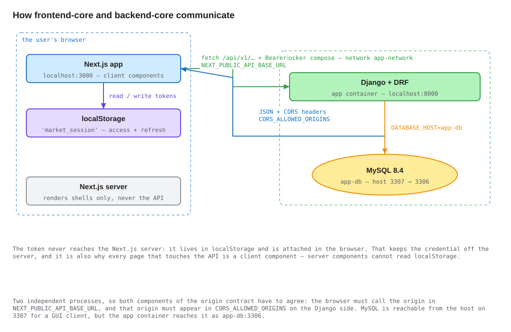

# Tamatem Marketplace — full-stack assessment

A small marketplace built as two independent services: a **Django REST API** and
a **Next.js storefront**. Register, browse a catalogue of 100 listings shipping
from Jordan and Saudi Arabia, filter by location, buy a listing, and get a
receipt.

Submitted as a technical assessment. Each half documents itself in depth; this
page covers the seam between them and the reasoning behind the stack.

| | | |
| --- | --- | --- |
| **[`backend-core/`](backend-core/README.md)** | Django 6.1 · DRF 3.18 · MySQL 8.4 · JWT | `:8000` |
| **[`frontend-core/`](frontend-core/README.md)** | Next.js 16 · React 19 · TypeScript · Tailwind v4 | `:3000` |

---

## How the two system components communicate



Editable source: [`docs/diagrams/fe-be-communication.excalidraw`](docs/diagrams/fe-be-communication.excalidraw) — see [Diagrams](#diagrams).

Two processes, no shared code, no shared database, and exactly one contract
between them: **JSON over HTTP with a bearer token.**

**The browser calls the API directly.** The Next.js server renders page shells
but never proxies API traffic and never sees a token. Sign-in stores
`{access, refresh, user}` in `localStorage`, and every subsequent request
attaches `Authorization: Bearer <access>` from the browser.

**The origin contract has two halves, and both must agree.** The client half is
`NEXT_PUBLIC_API_BASE_URL` in `frontend-core/.env.local`; the server half is
`CORS_ALLOWED_ORIGINS` in `backend-core/config/settings.py`, currently
`http://localhost:3000` and `http://127.0.0.1:3000`. Change the port the
frontend is served on and you must change both — this is the single most common
way to break a fresh setup.

**Token lifecycle across the boundary:**

1. `POST /api/v1/auth/login/` → `{access, refresh, user}`, stored under
   `market_session`.
2. Access token expires after 30 minutes. The next call gets a `401`.
3. The client refreshes at `POST /api/v1/auth/login/refresh/` **once** and
   replays the original request. Refresh is single-flight: because the API sets
   `ROTATE_REFRESH_TOKENS=True`, two parallel refreshes would spend the same
   refresh token twice and kill a live session.
4. The refresh token expires after 60 minutes and refreshing does not extend
   that window, so a session ends hard at one hour.
5. A failed refresh clears the session and redirects to
   `/login?next=<current path>`.

6. Signing out posts the refresh token to `POST /api/v1/auth/logout/`, which
   blacklists it server-side, and then clears the local session. The access
   token cannot be revoked — the blacklist covers refresh tokens only — so it
   stays valid until it expires, at most 30 minutes. Revoking the refresh token
   is what stops the session being extended past that.

Purchases **must** carry an `Idempotency-Key` header, generated per attempt and
reused on retry, so a retry after a timeout returns the original order instead of
placing a second one. Required rather than optional on purpose: optional would
make retry-safety depend on every client remembering to opt in. Note that a
custom header makes the browser send a CORS preflight, which is why `settings.py`
names it in `CORS_ALLOW_HEADERS` — `curl` sends no preflight, so this is a
failure mode you only see in a browser.

MySQL is reachable from the host on **3307** (mapped from 3306) for a GUI
client, but the API container reaches it as `app-db:3306` over the Compose
network — nothing outside Docker talks to the database.

---

## Technology choices

### Backend

| Choice                                 | Why here                                                                                                                                                                                                                                                                                                                                 | What it costs                                                                                                                   |
|----------------------------------------|------------------------------------------------------------------------------------------------------------------------------------------------------------------------------------------------------------------------------------------------------------------------------------------------------------------------------------------|---------------------------------------------------------------------------------------------------------------------------------|
| **Django + DRF** over FastAPI/Flask    | I chose Django + DRF because this project is mainly a database-driven API with authentication, products, and orders. Django provides models, migrations, authentication, and DRF gives me serializers, permissions, and pagination, so I can focus more on building the required features instead of setting up everything from scratch. | Django is more opinionated and heavier than Flask or FastAPI. For a smaller or highly async API, FastAPI could be a better fit. |
| **MySQL 8.4** over PostgreSQL          | MySQL is a good fit for this project because the data is relational and straightforward: users, products, and orders. It also supports transactions, which is useful for handling the purchase flow safely.                                                                                                                              | PostgreSQL provides more advanced features, but they would not add much value for the current requirements.                     |
| **Domain apps + a separate `api` app** | Models live in `products/`/`orders/`; every serializer, view and route lives under `api/v1/<domain>/`. The version boundary is a directory, so `/api/v2/` is a new package that reuses the same models.                                                                                                                                  | One more directory level and cross-package imports.                                                                             |
| **`uv`** over pip + venv               | I chose uv because it makes dependency management and virtual environment setup simple and fast. The lock file also helps ensure the project uses consistent package versions across different environments.                                                                                                                             | One more tool to install for host-side work.                                                                                    |
| **drf-yasg** over drf-spectacular      | I chose drf-yasg because it is straightforward to set up and provides an interactive Swagger UI for testing and documenting the API endpoints required by this project.                                                                                                                                                                  | It supports OpenAPI 2.0, while drf-spectacular is a more modern choice for projects that need OpenAPI 3.x features.             |

### Frontend

| Choice                                                              | Why here                                                                                                                                                                                                          | What it costs                                                                                                                                                                                           |
|---------------------------------------------------------------------|-------------------------------------------------------------------------------------------------------------------------------------------------------------------------------------------------------------------|---------------------------------------------------------------------------------------------------------------------------------------------------------------------------------------------------------|
| **Next.js App Router** over React + Vite                            | I chose Next.js because it provides React with built-in routing and a clear project structure. This makes pages like login, product listing, product details, and receipt easy to organize.                       | Some Next.js features are unnecessary for a small application, and React + Vite could be a simpler setup.                                                                                               |
| **Token in `localStorage`** over an httpOnly cookie                 | For this assignment, storing the JWT in localStorage keeps authentication simple and works well with a separate stateless backend API. The token can be attached to API requests from the frontend.               | The token is accessible from JavaScript, which means it needs careful protection against XSS attacks. An httpOnly cookie would provide better protection but requires a different authentication setup. |
| **Tailwind v4, CSS-first** over MUI/Chakra                          | Tailwind gives me flexibility to build the required responsive UI without being tied to a component library or its default design. It also keeps styling close to the components.                                 | Common UI components need to be built manually instead of being provided by a component library.                                                                                                        |
| **`@base-ui/react` + shadcn conventions** over a full component kit | This gives me accessible UI primitives while keeping control over the design and allowing me to include only the components I need.                                                                               | More components need to be implemented and styled manually compared with using a full component library.                                                                                                |
| **One React context, no state library**                             | The application has limited shared state, mainly authentication. AuthContext, local component state, and URL parameters are enough for authentication, pagination, and filters without adding another dependency. | If the application grows and needs more complex shared or cached state, a library such as TanStack Query or Redux could become useful.                                                                  |
| **`pnpm`** over npm                                                 | Content-addressed store, strict resolution, fast installs.                                                                                                                                                        | Requires Node 22.13+, which is a real prerequisite rather than a preference.                                                                                                                            |

---

## Running the whole thing

Full detail lives in each README; this is the ordered path.

**Prerequisites:** [Docker Desktop](https://docs.docker.com/get-started/get-docker/)
(Compose v2), GNU Make, [Node.js 22.13+](https://github.com/nvm-sh/nvm) and
[pnpm](https://pnpm.io/installation).

**1. Backend** — details in
[`backend-core/README.md`](backend-core/README.md#running-it):

```bash
cd backend-core
cp .env.example .env    # set DATABASE_HOST=app-db and match the app-db credentials
make build && make up
make migrate
docker compose exec app uv run python manage.py import_products items.csv
```

API on <http://localhost:8000>, Swagger at
<http://localhost:8000/swagger/>.

**2. Frontend** — details in
[`frontend-core/README.md`](frontend-core/README.md#running-it):

```bash
cd frontend-core
cp .env.example .env.local
pnpm install
pnpm dev
```

Storefront on <http://localhost:3000>. No accounts are seeded — register at
`/signup`.

**Tests:** `cd backend-core && make test` (or `uv run python manage.py test` on
the host — the settings swap to in-memory SQLite, so no MySQL is needed).
57 tests, 99% coverage. The frontend has no test suite; its gates are
`pnpm typecheck` and the type check inside `pnpm build`.

---

## Repository layout

```
tamatem-project/
├── backend-core/          Django REST API      → backend-core/README.md
├── frontend-core/         Next.js storefront   → frontend-core/README.md
├── docs/diagrams/         diagram generator + this page's diagram
└── README.md
```

---

## Diagrams

All five diagrams in this repository are generated by one zero-dependency
script, and each exists twice: an `.excalidraw` scene to edit and an `.svg` that
the READMEs embed.

```bash
node docs/diagrams/generate.mjs
```

[`docs/diagrams/generate.mjs`](docs/diagrams/generate.mjs) is deterministic —
reruns are byte-identical, so a regeneration only shows in git when a diagram
actually changed — and it refuses to emit a picture whose boxes or labels
overlap, which is checked geometrically rather than by eye.

To redraw one by hand, open the `.excalidraw` (drag it onto
[excalidraw.com](https://excalidraw.com), or open this repository as an Obsidian
vault) and export over the matching `.svg`. Same filename, so no README needs
editing.

---

## Future Work

- **Order history.** The one obviously missing endpoint: a `GET /api/v1/orders/`
  scoped to `request.user` — `ListAPIView` plus the existing `OrderSerializer`,
  paginated like products — and an `/orders` page. Everything needed is already
  in place.
- **Read/Write Database Splitting** — Add a primary (write) database with one or more 
  read replicas synced via MySQL replication, routing reads to replicas and writes to the primary. 
  This offloads read traffic for better scalability, and enables failover for higher availability.
- **Audit Logging** - Add audit log tables recording every user action (especially transactional ones like purchases), 
  capturing the actor, action, target, and timestamp. This gives a traceable history for disputes, debugging, 
  and fraud/compliance review on financial actions.
- **Search and sort.** The catalogue filters on `location` only. Title/description
  search and a price sort are a few lines in `ProductFilter` plus `OrderingFilter`,
  and would give `SiteHeader` the search box it currently omits.
- **Server-Side Auth (httpOnly Cookies).** Move the JWT from `localStorage` to an httpOnly cookie set via 
  a Next.js route handler proxying the API. This enables Server Components/streaming and removes the XSS-readable token, 
  at the cost of a second backend layer and a session concept the stateless API doesn't have today.
- **Sliding sessions.** Sessions currently end hard at 60 minutes because
  refreshing does not extend the refresh window. Sliding tokens, or issuing a
  new refresh with a fresh window, would fix it.
- **Quantity and a cart.** `quantity` exists on `Order` but is forced to 1
  server-side. Real quantities need stock tracking and validation; a cart needs
  a `Cart`/`CartItem` model and a multi-item checkout.
- **A payment step.** This is what would make `PENDING` and `FAILED` mean
  something — orders are created `COMPLETED` today because purchase settles
  synchronously.
- **CI/CD Pipeline.** Add GitHub Actions to run the Django test suite on every push/PR, 
  catching regressions before merge. Follow with automated deployment (ArgoCD, Jenkins, etc.) 
  to ship to the server automatically once merged. 