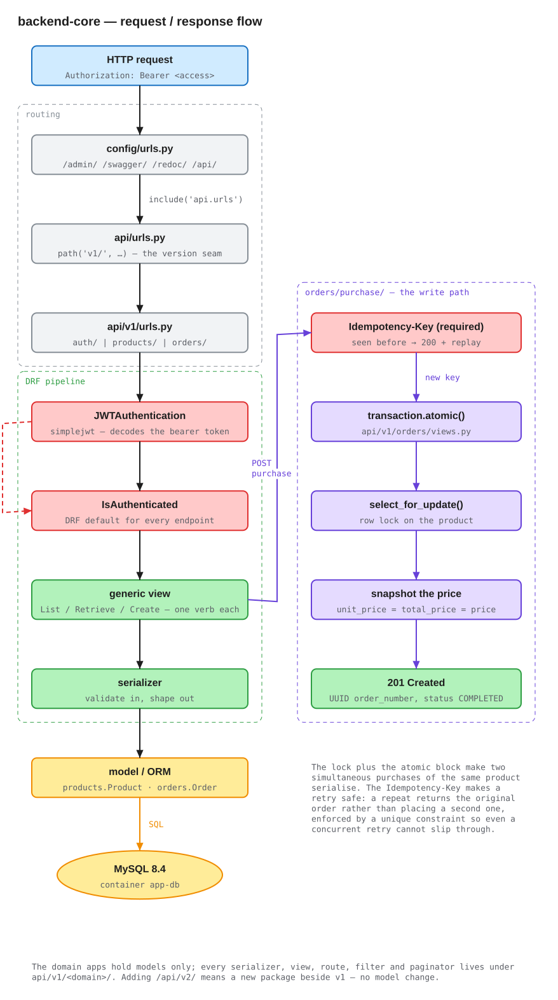
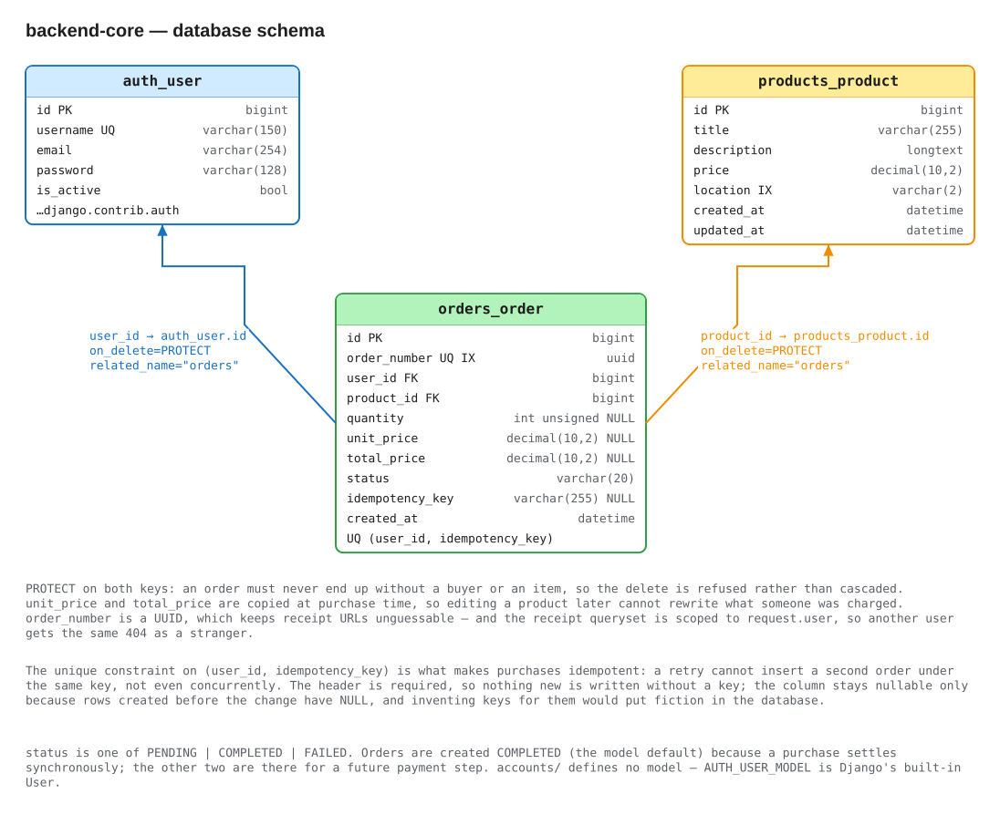

# backend-core — Tamatem Marketplace API

A Django REST Framework API for a small marketplace: register and sign in with
JWTs, browse a filtered and paginated product catalogue, buy a listing, and
fetch the receipt. MySQL for storage, Docker Compose for the runtime, `uv` for
dependencies.

Eight endpoints, three of them public:

| Method | Path | Auth |
| --- | --- | --- |
| `POST` | `/api/v1/auth/signup/` | public |
| `POST` | `/api/v1/auth/login/` | public |
| `POST` | `/api/v1/auth/login/refresh/` | public |
| `POST` | `/api/v1/auth/logout/` | Bearer |
| `GET` | `/api/v1/products/` | Bearer |
| `GET` | `/api/v1/products/<int:pk>/` | Bearer |
| `POST` | `/api/v1/orders/purchase/` | Bearer |
| `GET` | `/api/v1/orders/<uuid:order_number>/` | Bearer |

Interactive docs ship with the app: Swagger UI at
[`/swagger/`](http://localhost:8000/swagger/), ReDoc at
[`/redoc/`](http://localhost:8000/redoc/), raw schema at `/swagger.json`.
Django admin is at `/admin/`.

---

## Request / response flow



Editable source: [`docs/diagrams/request-flow.excalidraw`](docs/diagrams/request-flow.excalidraw) — see [Diagrams](#diagrams).

```
Every authenticated request carries `Authorization: Bearer <access>`.
`JWTAuthentication` is the project-wide default authentication class and
`IsAuthenticated` the project-wide default permission, so an endpoint is
protected unless it explicitly opts out with `AllowAny` — the three auth
endpoints are the only ones that do.
```
---

## API Documentation

The API is documented with OpenAPI. 
Source: [`docs/API Documentation.json`](docs/API%20Documentation.json) — see [Diagrams](#diagrams).

---
## Database



Editable source: [`docs/diagrams/erd.excalidraw`](docs/diagrams/erd.excalidraw)

### `products_product` — `products/models.py`

| Field | Type | Notes |
| --- | --- | --- |
| `id` | `BigAutoField` | PK (`DEFAULT_AUTO_FIELD`) |
| `title` | `CharField(255)` | |
| `description` | `TextField(blank=True)` | |
| `price` | `DecimalField(10, 2)` | exact decimal, never a float |
| `location` | `CharField(2)` | `JO` / `SA`, `db_index=True` |
| `created_at` / `updated_at` | `DateTimeField` | `auto_now_add` / `auto_now` |

`location` is indexed because it is the one filterable column, so the index
matches the only query the API can actually generate.

### `orders_order` — `orders/models.py`

| Field | Type | Notes |
| --- | --- | --- |
| `id` | `BigAutoField` | PK |
| `order_number` | `UUIDField` | `unique`, indexed, `editable=False` |
| `user` | `FK → AUTH_USER_MODEL` | `PROTECT`, `related_name="orders"` |
| `product` | `FK → products.Product` | `PROTECT`, `related_name="orders"` |
| `quantity` | `PositiveIntegerField(null=True)` | always 1 today |
| `unit_price` / `total_price` | `DecimalField(10, 2, null=True)` | snapshot at purchase |
| `status` | `CharField(20)` | default `COMPLETED` |
| `idempotency_key` | `CharField(255, null=True)` | unique with `user` |
| `created_at` | `DateTimeField` | `Meta.ordering = ["-created_at"]` |

Constraint: `UniqueConstraint(fields=["user", "idempotency_key"])`, named
`uniq_order_user_idempotency_key`. Unconditional on purpose — MySQL has no
partial indexes, so a `condition=` would not build there. It does not need one:
both MySQL and SQLite treat `NULL`s as distinct in a unique index, so a user can
still have any number of key-less orders.

Five decisions worth defending:

- **`PROTECT` on both foreign keys.** An order must never end up without a buyer
  or without an item. `CASCADE` would make deleting a product quietly destroy
  the record that someone paid for it, and `SET_NULL` would leave a receipt
  pointing at nothing. `PROTECT` refuses the delete instead, which is the honest
  answer for a financial record.
- **Prices are copied onto the order.** `unit_price` and `total_price` are
  written from `product.price` at purchase time rather than read through the
  foreign key. Editing a product tomorrow cannot rewrite what a customer was
  charged yesterday.
- **`order_number` is a UUID.** Receipt URLs are handed out, and a sequential id
  would let anyone walk the range. Combined with the per-user queryset scoping,
  a receipt is neither guessable nor readable by the wrong account.
- **`quantity` is server-side.** It is nullable only because the column was
  added ahead of a real cart; the API never accepts it from a client.
- **Idempotency is enforced by the database.** A view-level check cannot stop
  two concurrent retries from both inserting. The unique constraint can, and the
  view's job is only to turn the resulting `IntegrityError` into the original
  order.

`status` is one of `PENDING | COMPLETED | FAILED`. Orders are created
**`COMPLETED`** because a purchase settles synchronously — there is no payment
step to be pending on. The other two values exist for when there is one.

`accounts/` defines **no model**. `AUTH_USER_MODEL` is left at Django's built-in
`auth.User`, so the table is `auth_user`. Swapping in a custom user model after
the first migration is painful, and nothing here needs a field Django doesn't
already provide.

---

## Architecture

Domain and API are split, and that split is the main structural idea:

```
backend-core/
├── config/                  project settings, root urls, wsgi/asgi
│   ├── settings.py           INSTALLED_APPS, DRF, SIMPLE_JWT, CORS, swagger
│   └── urls.py               /admin/  /swagger/  /redoc/  → /api/
│
├── accounts/                domain app — no model; auth uses django.contrib.auth
├── products/                domain app
│   ├── models.py             Product
│   ├── enums.py              Location (JO, SA)
│   ├── admin.py              list_display / list_filter / search_fields
│   ├── migrations/
│   └── management/commands/
│       └── import_products.py    CSV seeder
├── orders/                  domain app
│   ├── models.py             Order
│   ├── enums.py              OrderStatus (PENDING, COMPLETED, FAILED)
│   └── admin.py
│
├── api/                     every HTTP concern lives here
│   ├── urls.py               path('v1/', …)   ← the version seam
│   └── v1/
│       ├── urls.py           auth/ | products/ | orders/
│       ├── accounts/         serializers · views · urls · swagger_schemas · tests
│       ├── products/         + filters.py · pagination.py
│       └── orders/
│
├── items.csv                100 seed products, 50 JO / 50 SA
├── Dockerfile · docker-compose.yml · Makefile
└── pyproject.toml · uv.lock
```

**Domain apps own data; the `api` app owns HTTP.** Models, enums, admin and
migrations live in `products/` and `orders/`. Every serializer, view, route,
filter, paginator, swagger schema and test lives under `api/v1/<domain>/`.

The payoff is that the version boundary is a directory. `/api/v2/` is a new
package beside `v1` that imports the same models — no model change, no
conditional branching on a version header, and `v1` keeps working untouched
while `v2` is written. The cost is one extra directory level and imports that
cross packages (`from api.v1.products.serializers import ProductSerializer`),
which is a fair trade for a boundary you will eventually need.

Two smaller conventions:

- **Views are DRF generics, not `ViewSet`s.** `ListAPIView`, `RetrieveAPIView`,
  `CreateAPIView`. Each endpoint here has exactly one verb; a router-registered
  `ViewSet` would generate update and destroy routes nobody asked for, and
  suppressing them is more code than not creating them.
- **Enums are `str, Enum` with a `choices()` helper**, not Django's
  `TextChoices`. It keeps `Location` and `OrderStatus` importable and comparable
  in plain Python — including in the CSV importer, which validates before Django
  fields are involved.

---

## Technology and dependencies

Python 3.13, managed with [`uv`](https://docs.astral.sh/uv/). Every version
below is the one pinned in `uv.lock`.

| Package | Version |
| --- | --- | 
| `django` | 6.1 |
| `djangorestframework` | 3.18.0 | 
| `djangorestframework-simplejwt` | 5.5.1 | 
| `django-filter` | 26.1 | 
| `django-cors-headers` | 4.9.0 |
| `drf-yasg` | 1.21.15 | 
| `mysqlclient` | 2.2.8 | 
| `dotenv` | 0.9.9 | 
| `coverage` | 7.15.4 | 
| `djangorestframework-stubs` | 3.18.0 |

---

## Running it

### Prerequisites

- **[Docker Desktop](https://docs.docker.com/get-started/get-docker/)** with
  Compose v2. The Makefile calls `docker compose` (a subcommand), not the older
  standalone `docker-compose`.
- **GNU Make** — preinstalled on macOS and Linux; on Windows use WSL2.
- **[`uv`](https://docs.astral.sh/uv/getting-started/installation/)** only if you
  want to run tests or manage dependencies on the host rather than in the
  container.

### First run

```bash
cp .env.example .env
```

`.env` needs five keys, and four of them must agree with the `app-db` service in
`docker-compose.yml`:

```dotenv
SECRET_KEY=<any long random string>
MYSQL_DATABASE=tamatem-market
MYSQL_USER=tamtam
MYSQL_PASSWORD=tamtam123
DATABASE_HOST=app-db
```

> **`DATABASE_HOST=app-db`** is the value people get wrong. It is the Compose
> service name, resolved on the `app-network` bridge. `localhost` cannot work
> from inside the `app` container — that would be the container itself.

Then:

```bash
make build     # build the app image
make up        # start app-db, wait for its healthcheck, then start app
make migrate   # nothing migrates automatically — there is no entrypoint script
               # applies orders/products, token_blacklist, and orders 0002
               # (the idempotency key + its unique constraint)
docker compose exec app uv run python manage.py import_products items.csv
```

The API is now on <http://localhost:8000>. Optionally add an admin user for
`/admin/`:

```bash
docker compose exec app uv run python manage.py createsuperuser
```

There are no seeded user accounts, so the first API user comes from
`POST /api/v1/auth/signup/`.

### Ports

| Service | Container | Host | Why |
| --- | --- | --- | --- |
| `app` | 8000 | **8000** | matches the frontend's `NEXT_PUBLIC_API_BASE_URL` default |
| `app-db` | 3306 | **3307** | so it doesn't collide with a MySQL already installed on the host |

Point a GUI client at `127.0.0.1:3307`; the app container reaches the same
database as `app-db:3306`.

### Make targets

| Target | Runs |
| --- | --- |
| `make build` | `docker compose build` |
| `make build-no-cache` | `docker compose build --no-cache` |
| `make up` | `up -d --remove-orphans` |
| `make down` | `down --remove-orphans` |
| `make restart` / `make ps` / `make logs` | as named (`logs` follows) |
| `make migrate` / `make makemigrations` | `manage.py migrate` / `makemigrations` |
| `make shell` | Django shell in the container |
| `make check` | `manage.py check` |
| `make test` | `manage.py test` |
| `make test-coverage` | `coverage run manage.py test` then `coverage report -m` |
| `make clean` | `down -v` — **also drops the MySQL volume** |

`make help` prints the same list. There is no target for `createsuperuser` or
`import_products`; run those through `docker compose exec` as shown above.

### Adding a dependency

`docker-compose.yml` bind-mounts the source at `.:/app` and then masks
`/app/.venv` with an anonymous volume, so the container's virtualenv is not
shadowed by the host directory. That anonymous volume also survives a plain
rebuild, so a new dependency needs the volume recreated:

```bash
uv add <package>          # updates pyproject.toml + uv.lock
make build && docker compose up -d --force-recreate --renew-anon-volumes app
```

Skipping `--renew-anon-volumes` leaves the old virtualenv in place and the
import fails in a container that was, by all appearances, just rebuilt.

### Seeding the catalogue

```bash
docker compose exec app uv run python manage.py import_products items.csv
docker compose exec app uv run python manage.py import_products items.csv --truncate
```

`items.csv` has columns `id,title,description,price,location` and 100 rows, 50
`JO` and 50 `SA`. The importer:

- reads with `encoding="utf-8-sig"`, so a spreadsheet-exported BOM doesn't
  corrupt the first header;
- runs entirely inside one `transaction.atomic()` — a bad file leaves the table
  as it was;
- **upserts** with `update_or_create(pk=csv_id, …)`, so re-running is idempotent
  rather than duplicating the catalogue;
- resets the id sequence afterwards, so auto-generated primary keys don't
  collide with the imported ones;
- skips and reports bad rows (non-numeric id, empty title, unparseable price,
  location outside `JO`/`SA`) instead of aborting the whole import;
- takes `--truncate` to delete existing products first.

---

## Tests

```bash
make test                 # in the container
make test-coverage        # + a line-by-line coverage report
uv run python manage.py test    # on the host, no Docker or MySQL needed
```

Host-side runs work because `config/settings.py` swaps the database for
in-memory SQLite when it sees `manage.py test`, so the suite needs no MySQL
credentials and leaves nothing behind.

Note that `make check` (and `manage.py check` on the host) needs the container:
it opens a database connection, and `DATABASE_HOST=app-db` does not resolve from
the host.

**Verified result** — `uv run python manage.py test`, 2026-08-22:

```
Ran 57 tests in 23.404s

OK
```

Coverage is **99%** (857 statements, 11 missed) — mostly `__str__` methods and
defensive branches that need a real race to reach.

The suite uses `rest_framework.test.APITestCase` with Django's own runner —
there is no pytest. Coverage by area:

- **`api/v1/accounts/tests.py`** — signup success and token issuing, password
  hashing, mismatched confirmation, weak password, duplicate email, duplicate
  username, missing fields, the `IntegrityError` → 409 race, and the
  unexpected-exception → clean 500 with its log record. Login covers success,
  wrong password, unknown user, wrong-case username, inactive user, missing
  fields, and a 500. Logout covers revocation (proved by then *failing* to
  refresh with the token), the blacklist row, double logout, unauthenticated
  access, another user's token, a missing field, a malformed token, an access
  token posted by mistake, and that rotation retires the token it consumed.
- **`api/v1/products/tests.py`** — 401 without a token, the paginated body
  shape, `?location=jo` case-insensitivity, `?location=EG` → 400, whitespace
  trimming, and that `?page_size=100` against 27 products returns 20 with a
  `next` link. Detail: 401, 200, and 404.
- **`api/v1/orders/tests.py`** — purchase writes exactly one order with
  `quantity=1` and `unit_price == total_price == product.price`; 401 creates
  nothing; missing, zero and unknown `product_id` all 400. Receipt: own order
  200, unauthenticated 401, another user's order 404, unknown UUID 404 with the
  identical message. Idempotency covers first purchase, retry returning the
  identical body, repeated retries, distinct keys, per-user scoping, rejection of
  a missing key and of blank/whitespace-only keys, trimming, the 255-character
  boundary either side, and the concurrent-retry race resolved through the
  unique constraint.
  Two of them assert the **CORS** preflight allows `Idempotency-Key` and that
  `Idempotent-Replay` is exposed. Those exist because nothing else would catch
  it: the test client sends no preflight, so the whole feature can pass its
  tests and still fail in a browser.

---

## Diagrams

The diagrams above are generated, and each exists twice:

```
docs/
├── diagrams/
|   ├── request-flow.excalidraw   ← edit this
|   ├── request-flow.svg          ← the README embeds this
|   ├── erd.excalidraw
|   └── erd.svg
└── API Documentation.json
```