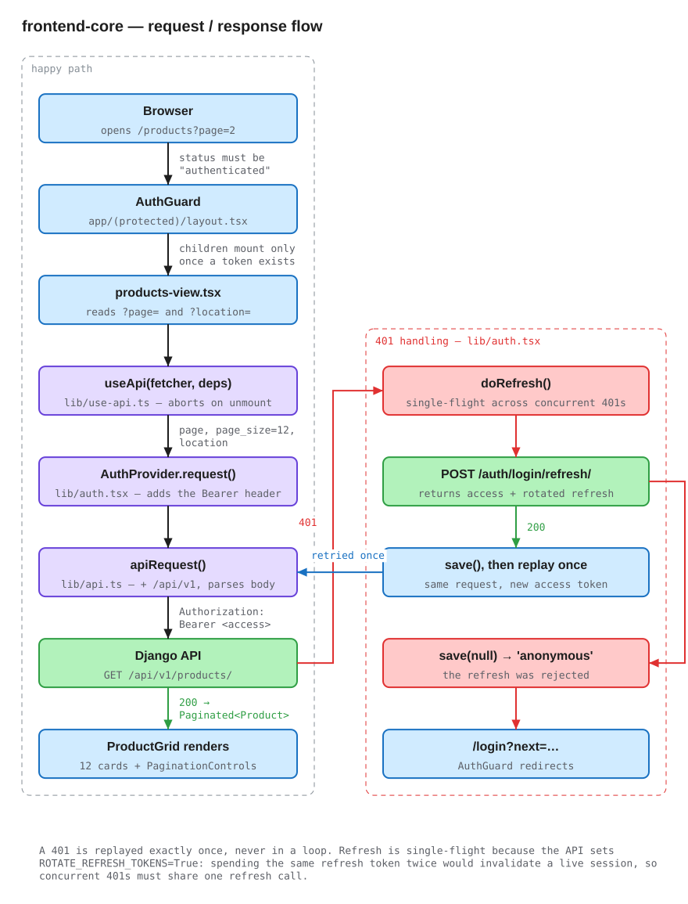
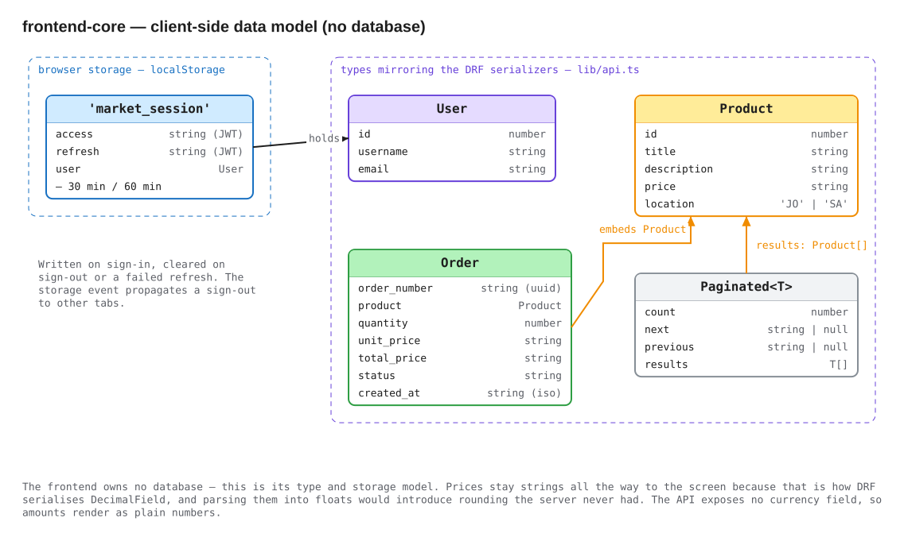

# frontend-core — Tamatem Market storefront

A Next.js App Router storefront over the [`backend-core`](../backend-core)
Django API: sign in or register, browse a paginated catalogue filtered by
location, open a listing, buy it, and land on a receipt.

Five routes, and everything that outlives a page lives in one React context —
everything else is derived from the URL.

| Route | Access | Purpose |
| --- | --- | --- |
| `/` | public | redirects to `/products` |
| `/login` | public | sign in; returns to `?next=` |
| `/signup` | public | create an account |
| `/products` | token | paginated grid, `?page=` and `?location=` |
| `/products/<id>` | token | listing detail and Buy |
| `/receipt/<order_number>` | token | order receipt |

---

## Request / response flow



Editable source: [`docs/diagrams/request-flow.excalidraw`](docs/diagrams/request-flow.excalidraw) — see [Diagrams](#diagrams).

Four layers sit between a page and the API, each with one job:

| Layer | File | Responsibility |
| --- | --- | --- |
| `useApi(fetcher, deps)` | `lib/use-api.ts` | lifecycle — one `AbortController` per run, cancel on unmount, ignore out-of-order responses |
| `AuthProvider.request()` | `lib/auth.tsx` | credentials — attach the bearer token, refresh and replay on a 401 |
| `apiRequest()` | `lib/api.ts` | transport — build the URL, set headers, parse the body |
| `ApiError` | `lib/errors.ts` | normalise every failure shape into one type |

Keeping them separate is what makes the tricky parts small: cancellation does
not know about tokens, and token refresh does not know about React.

### Authentication

Signing in stores `{access, refresh, user}` in `localStorage` under
`market_session`. Every authenticated call goes through `request()`, which
attaches `Authorization: Bearer <access>`.

On a `401`, `request()` refreshes once and replays the original request — once,
never in a loop. Refresh is **single-flight**: concurrent 401s share one
in-flight promise. That is not an optimisation, it is a correctness requirement.
The API sets `ROTATE_REFRESH_TOKENS=True`, so each refresh invalidates the token
it consumed; two parallel refreshes would spend the same refresh token twice and
kill a live session. The rotated `refresh` that comes back is stored, not
discarded.

When a refresh fails the session is cleared, `status` becomes `'anonymous'`,
and `AuthGuard` redirects to `/login?next=<current path>`. The `storage` event
listener means signing out in one tab signs out the others.

`logout()` revokes for real: it posts the refresh token to
`POST /auth/logout/`, which blacklists it server-side, and then clears the local
session. Three details are deliberate:

- **The local session is cleared in a `finally`.** If the network call fails the
  user still ends up signed out on this device. Leaving them signed in because a
  request failed is the worse outcome — the intent to leave was explicit.
- **It bypasses `request()`.** That wrapper refreshes and replays on a 401, which
  would mint a *brand-new* refresh token on the way out of the door. `logout()`
  calls `apiRequest` directly with the current access token instead.
- **The button is disabled while in flight.** Sign-out is now a round trip, and a
  second click would post an already-blacklisted token and get a `400`.

The access token is not revoked — the API's blacklist covers refresh tokens only
— so it stays technically valid until it expires, at most 30 minutes later. What
logging out guarantees is that the session cannot be *extended* past that.

### Error shapes

The API answers with at least three different error bodies — `{"detail": …}`,
`{"field": ["msg"]}`, `{"field": "msg"}` — plus Django's HTML debug page when
`DEBUG=True` and something unhandled goes wrong. `buildApiError` folds all of
them into one `ApiError` carrying `status`, a human `detail`, and `fieldErrors`
keyed by field, so a form can highlight inputs and a page can show a banner
from the same object. Two details worth knowing:

- **`status === 0` means the request never reached the server.** Network
  failure, DNS, CORS — anything where there is no HTTP status to report.
- **Non-JSON bodies become `null`**, so a Django debug page never gets rendered
  into the UI as garbage text.

---

## Client data model

The frontend owns no database. Its equivalent is one `localStorage` record plus
the types in `lib/api.ts` that mirror the DRF serializers.



<sub>Editable source: [`docs/diagrams/client-data-model.excalidraw`](docs/diagrams/client-data-model.excalidraw)</sub>

| Type | Fields |
| --- | --- |
| `Session` | `access: string`, `refresh: string`, `user: User` — the `market_session` value |
| `User` | `id: number`, `username: string`, `email: string` |
| `Product` | `id: number`, `title: string`, `description: string`, `price: string`, `location: 'JO' \| 'SA'` |
| `Order` | `order_number: string`, `product: Product`, `quantity: number`, `unit_price: string`, `total_price: string`, `status: string`, `created_at: string` |
| `Paginated<T>` | `count: number`, `next: string \| null`, `previous: string \| null`, `results: T[]` |

Endpoints are constants rather than inline strings (`EP` in `lib/api.ts`), all
with the trailing slash Django's `APPEND_SLASH` expects:

```ts
EP.login      // 'auth/login/'
EP.refresh    // 'auth/login/refresh/'
EP.logout     // 'auth/logout/'
EP.signup     // 'auth/signup/'
EP.products   // 'products/'
EP.product(id)
EP.purchase   // 'orders/purchase/'
EP.order(orderNumber)
```

**Prices stay strings** the whole way to the screen. That is how DRF serialises
`DecimalField`, and parsing them into floats would introduce rounding the server
never had. `formatAmount` prints a fixed two decimals and **no currency symbol**,
because the API exposes no currency field — and listings ship from both Jordan
and Saudi Arabia, so guessing one would be wrong for half the catalogue.

`apiUrl()` deliberately has no "pass through absolute URLs" escape hatch, which
is why pagination is driven from `count` rather than from DRF's `next`/
`previous`: those are absolute `http://localhost:8000/...` URLs, and following
them from the client would leak the API origin into browser navigation.

---

## Architecture

```
frontend-core/
├── app/
│   ├── layout.tsx              metadata, viewport, <html> + Providers
│   ├── providers.tsx           ThemeProvider → AuthProvider
│   ├── globals.css             ALL Tailwind config + design tokens
│   ├── error.tsx               error boundary
│   ├── not-found.tsx           404
│   │
│   ├── (auth)/                 route group — no URL segment
│   │   ├── layout.tsx          inverse guard: signed-in visitors bounce out
│   │   ├── login/page.tsx      → /login
│   │   └── signup/page.tsx     → /signup
│   │
│   └── (protected)/            route group — no URL segment
│       ├── layout.tsx          SiteHeader + <AuthGuard>
│       ├── products/
│       │   ├── page.tsx        → /products  (Suspense boundary)
│       │   ├── products-view.tsx   the actual client page
│       │   └── [id]/page.tsx   → /products/<id>
│       └── receipt/[orderNumber]/page.tsx   → /receipt/<uuid>
│
├── components/
│   ├── auth-form.tsx           shared login/signup form
│   ├── auth-guard.tsx          the route guard
│   ├── product-card.tsx  product-grid.tsx  pagination-controls.tsx
│   ├── site-header.tsx   theme-toggle.tsx  field-errors.tsx  skeletons.tsx
│   └── ui/button.tsx           the only shadcn primitive in the project
│
├── lib/
│   ├── api.ts                  endpoints, types, fetch wrapper
│   ├── auth.tsx                session, single-flight refresh, request()
│   ├── errors.ts               ApiError / SessionExpiredError
│   ├── use-api.ts              fetch-with-cancellation hook
│   ├── format.ts               amount / date / location formatting
│   └── utils.ts                cn()
│
├── next.config.mjs   tsconfig.json   postcss.config.mjs   components.json
└── .env.example
```

### Route groups carry the guard

`(auth)` and `(protected)` add no URL segment; they exist so the guard is
declared **once**. `AuthGuard` is mounted in `app/(protected)/layout.tsx` and
every protected page inherits it, instead of each page repeating a check that
one of them will eventually forget.

`AuthGuard` withholds children until `status === 'authenticated'` rather than
rendering them and redirecting afterwards. That ordering matters: if children
mounted first, their fetch effects would fire before a token existed and every
protected page would start with an avoidable 401.

There is **no `middleware.ts`**, and that follows from the token living in
`localStorage`: middleware runs on the server, which cannot read it. Gating is
necessarily client-side here.

`?next=` is validated against `/^\/(?!\/)/` before any redirect — relative
paths only, and not protocol-relative `//evil.com`, so the parameter cannot be
turned into an open redirect.

### Why some pages are split in two

`app/(protected)/products/page.tsx` is a thin server component whose only job is
a `Suspense` boundary around `products-view.tsx`. Same for `/login` and
`/signup` around `AuthForm`. Any component calling `useSearchParams()` must sit
inside a `Suspense` boundary or the production prerender fails — the split is
what makes `next build` succeed.

### Guarding ids before fetching

The detail page tests `/^\d+$/` and the receipt page tests a UUID pattern before
fetching, mirroring the server's `<int:pk>` and `<uuid:order_number>` route
converters. A non-matching path never reaches Django, where it would produce an
HTML 404 rather than the JSON the client expects.

The receipt page **re-fetches** the order instead of receiving it as state from
the purchase. That is what makes a receipt URL survive a refresh, a bookmark or
a share.

### Buying exactly once

Double-submission is guarded at three levels, because each one covers a case the
others cannot:

| Guard | Stops |
| --- | --- |
| `submitting` state | the button being clicked again while a request is open |
| `inFlight` ref | two clicks landing in the same tick, before React re-renders |
| `Idempotency-Key` header | a duplicate reaching the server at all |

The first two are local and cannot help once a request has left the browser: a
purchase that times out might still have succeeded. So the Buy handler generates
a key on the first attempt, keeps it in a ref across retries, and clears it only
once an order is placed. Retrying a failed Buy therefore reuses the key, and the
API answers with the order the first call created rather than placing a second
one. A later, intentional purchase gets a fresh key.

The API **requires** the header — a purchase without it is a `400` — so the key
cannot be treated as best-effort. That is why it comes from
`newIdempotencyKey()` in `lib/api.ts` rather than a bare `crypto.randomUUID()`:
`randomUUID` exists only in a secure context, so on plain HTTP served from
anything other than `localhost` it is `undefined` and buying would throw. The
helper falls back to `crypto.getRandomValues`, then to a timestamp plus
`Math.random`.

Because `request()` replays the original `options` after a token refresh, the
header survives the 401-refresh-replay path for free.

---

## Technology and dependencies

| Package | Resolved |
| --- | --- | 
| `next` | **16.3.0** (pinned exactly) |
| `react` / `react-dom` | 19.2.4 | 
| `typescript` | **5.7.3** (pinned) | 
| `tailwindcss` + `@tailwindcss/postcss` | 4.3.3 | 
| `@base-ui/react` | 1.5.0 | 
| `class-variance-authority` | 0.7.1 | 
| `tailwind-merge` + `clsx` | 3.4.0 / 2.1.1 | 
| `next-themes` | 0.4.6 | 
| `lucide-react` | 1.17.0 | 
| `tw-animate-css` | 1.4.0 |
| `shadcn` | 4.10.0 | 

### The design system

`app/globals.css` holds the whole thing: `@theme inline` maps Tailwind's colour
tokens to CSS variables; `:root` and `.dark` each define the full palette in
`oklch()`; `@layer components` defines the app's own classes (`.store-hero`,
`.category-pill`, `.status-chip`, `.field-label`, `.nav-link`, …). Corner radii
are pinned to `0px` — a deliberate square-edged look, not an oversight.

---

## Running it

### Prerequisites

- **Node.js 22.13 or newer.** Not optional: `pnpm` refuses to run on Node 20 and
  exits non-zero before installing anything.

  ```console
  $ node -v && pnpm --version
  v20.19.5
  warn: This version of pnpm requires at least Node.js v22.13
  ```

  With [nvm](https://github.com/nvm-sh/nvm): `nvm use 22`.
- **pnpm 9+** — `corepack enable pnpm`, or see the
  [pnpm install docs](https://pnpm.io/installation).
- **A running backend.** See [`../backend-core/README.md`](../backend-core/README.md#running-it).

### Steps

Start the backend first, and make sure the catalogue is seeded — an empty
database gives you a working but empty grid:

```bash
cd ../backend-core
make up && make migrate
docker compose exec app uv run python manage.py import_products items.csv
```

Then:

```bash
cd ../frontend-core
cp .env.example .env.local
pnpm install
pnpm dev
```

Open <http://localhost:3000>. There are no seeded accounts, so register at
`/signup` on first run.

### Configuration

`NEXT_PUBLIC_API_BASE_URL` is the only variable — the API **origin**, with no
trailing slash and no path:

```dotenv
NEXT_PUBLIC_API_BASE_URL=http://localhost:8000
```

`lib/api.ts` appends `/api/v1` itself. Being a `NEXT_PUBLIC_` variable it is
inlined at build time, so a change needs a dev-server restart or a rebuild — it
is not read at runtime. If it is missing, the first request throws an explicit
`ApiError` naming the file to copy, rather than silently calling the Next.js
origin and 404ing.

The other half of this contract lives on the server: the origin you serve from
must appear in `CORS_ALLOWED_ORIGINS` in `backend-core/config/settings.py`, which
currently lists `http://localhost:3000` and `http://127.0.0.1:3000`. Serving the
frontend on a different port means adding it there too.

### Scripts

| Script | Does |
| --- | --- |
| `pnpm dev` | dev server on port 3000 |
| `pnpm build` | production build — includes a full TypeScript check |
| `pnpm start` | serve a production build |
| `pnpm typecheck` | `tsc --noEmit` |

**Quality gates are `pnpm typecheck` and the type check inside `pnpm build`.**
There are no tests and no ESLint configuration: Next.js 16 removed `next lint`,
and no replacement was set up. That is a real gap, listed under
[future work](../README.md#future-features) rather than dressed up.

**Verified** — `tsc --noEmit` under Node 22.23.2, 2026-08-22: exit 0, no
diagnostics.

---

## Diagrams

Both diagrams above are generated, and each exists twice:

```
docs/diagrams/
├── request-flow.excalidraw       ← edit this
├── request-flow.svg              ← the README embeds this
├── client-data-model.excalidraw
└── client-data-model.svg
```